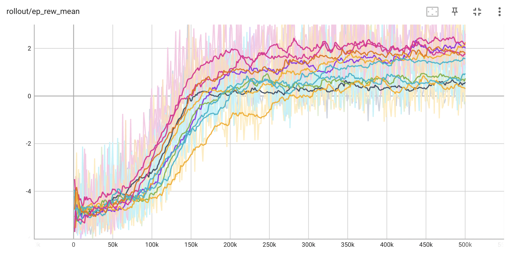
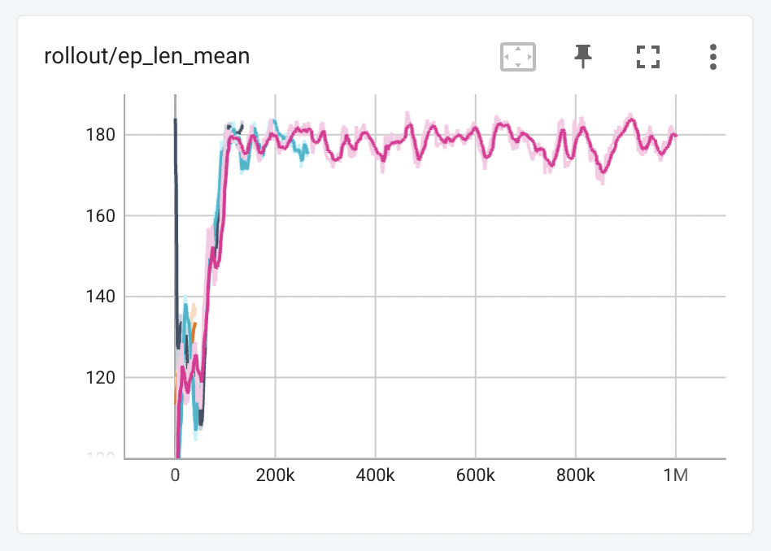

# gym-SQLI

Simulation environment to test SQL Injection based attacks on a system using ML models.

Extension to the research project [CTF-SQL](https://github.com/FMZennaro/CTF-SQL) that implements the model and
simulations from the 2021 research
paper [Simulating SQL Injection Vulnerability Exploitation Using Q-Learning Reinforcement Learning Agents](https://arxiv.org/pdf/2101.03118.pdf)

### Requirements

The following code requires *numpy* and [opanai gym](https://www.gymlibrary.dev/).

### Installation

Clone this git and run `pip install -e gym-SQLI` to make this environment available to *OpenAI gym*.

### Content

Error Message Env [run test](./tests/backtest_error.py)

- Run model on simulation env over an action space to find SQL error messages
- [gym env](./sqli_sim/envs/error_env.py)

Run tersorboard graphs: ` tensorboard --logdir=./tests/logs/reward/ --port=6006`

Flag Env (wip) [run test](./tests/backtest_error_flag.py)

- Run model on simulation env to use error messages (observations) to find a flag via SQLI
- PPO and DQN models available
- [gym env](./sqli_sim/envs/error_flag_env.py)

Run tersorboard graphs: ` tensorboard --logdir=./tests/logs/flag/ --port=6006`

## Experiments

### Error Message Reward Space

The environment generates a random SQL injection command and a random database type for each trial, and the agent can
select actions from the action space to attempt to perform a successful SQLI attack on the database. The current state
of the agent (i.e., the agent’s history of actions and the resulting error messages)
is tracked in the observations and returns an observation of the current state, a reward based on the success or failure
of the agent’s latest action, and a flag indicating whether the trial is complete (either because the agent has
successfully performed a SQL injection attack or because the maximum number of steps has been reached).

To evaluate the performance of the system, two reinforcement learning models using the Stable Baselines library:
Deep Q-Network (DQN) and Proximal Policy Optimization (PPO) were trained and tested. The gym library was used to create
a custom environment for the simulations called db_sim-v1 to represent the error message simulator env registered to
gym.

When expanding the simulation model to 11 steps we can see the PPO model is able to find actions to uncover the error
values but is still unable to use them to consistently find the flag, and it values the safe actions in these given
timesteps to uncover the information.



The model values taking the safe approach to obtain the error messages but does not find the association in the table to
find the flag. In this space the flag is not always present, and it is not an MDP, so it is not surprising the model
does not find the flag very often, and actually values avoiding the injection commands altogether to get more rewards
from error messages.

In the [DB Probs](./tests/db_probs.py) file a monte-carlo simulator is made to show the expected value when the model
chooses actions randomly and by a "smart agent" which exploits any positive error message found. The PPO model performs
better than both of these.

### SQLI Flag Space

In changing the environment to a closed MDP where we can associate actions in the error space with an observation in the
error required to uncover the flag (remove randomness and dead ends found in the real world we attempted to simulate)
the model continues to perform poorly as seen when the action space got too large in the previous researchers’ paper.
This leads to the conclusion that using a DQN or PPO for an MDP of finding the flag in a larger action space may not be
suitable in this case, and further models with a wider range of observation (as seen can be collected in the error env
by a model) should be studied to conduct SQLI in a capture the flag setting. Changing the reward values to train the
model can also be used in order to avoid the same wrong actions being take over and over again, as is observed after a
few epochs in the flag sim on both DQN and PPO models.



This graph shows the training on an action space of 184 actions that contains a relationship between the actions to be
taken and the location of the flag. The space is solvable on avg. 12 steps and is shown to be an MDP which should have
the relations necessary to train the DQN model. A step limit of 184 steps when used to avoid the model from continuously
taking the same wrong action (as it continues to do). The agent w/ associations built in was created to show how the
associations between actions should exist to find the flag in this simulation space.

- [Prove MDP](./tests/flag_env/is_mdp.py)
- [Manual Agent](./tests/flag_env/manual_agent.py)
- [Agent w/ Associations built in](./tests/flag_env/self_acting_agent.py)

The association in the action-space used by the agent is shown below:

```python
def step(action):
    if 21 > action % 37 > 0:
        escape = action // 37
        if 5 > action % 37 > 0:
            table_action = action
        else:
            action_on_table = action
            flag_injection = action + 16
```

```
for each n in action space n = n % 37
0-4   = find escape char + action
5-20  = find table + action
21-36 = find injection cmd
```
